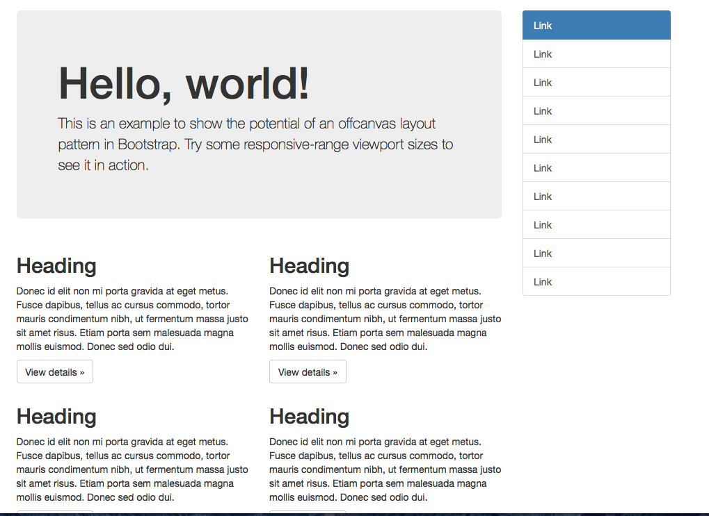

Day 16 - HTML / Middleman
====================

Quiz 1: Column Review
--------

Create HTML specified in the following image. Use bootstrap and codepen:




1. Quiz 1: Columns
1. Lab Review
1. Middleman Commands
1. Middleman Asset Pipeline
1. Middleman Pages
1. Quiz 2: Chess


Quiz 2: Chess Board
-------------

Create HTML specified in the following image. No need for bootstrap


```
&#9812; = ♔
&#9813; = ♕
&#9814; = ♖
&#9815; = ♗
&#9816; = ♘
&#9817; = ♙
&#9818; = ♚
&#9819; = ♛
&#9820; = ♜
&#9821; = ♝
&#9822; = ♞
&#9823; = ♟
```


Homework
--------------

1. Create your surf-and-paddle in middleman from your codepen
1. Get the asset pipeline working
1. complete the page if you stopped short

